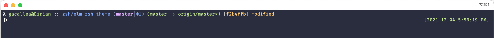

# Elm Zsh Theme

```Elm``` is a simple Zsh theme that I fancy and that I've created for personal use. Its name (which is a tribute to [Elm Lang](https://elm-lang.org)), and the leading ```λ``` and separator ```::``` characters, are an expression of my love for functional programming.



## FEATURES

PROMPT:

- leading character
- user @ hostname
- separator character
- path: 1up/current dir
- git_super_status
- branch_info

RPROMPT:

- date and clock

## USAGE

### Download the theme's files

These ```cURL``` commands will download the theme files in the right directory:

```bash
curl -sLJ https://raw.githubusercontent.com/gacallea/elm-zsh-theme/main/themes/elm-light.zsh-theme -o $ZSH_CUSTOM/themes/elm-light.zsh-theme
```

```bash
curl -sLJ https://raw.githubusercontent.com/gacallea/elm-zsh-theme/main/themes/elm-dark.zsh-theme -o $ZSH_CUSTOM/themes/elm-dark.zsh-theme
```

### Choose a variant

This theme comes with two variants:

- [elm dark](./themes/elm-dark.zsh-theme): suitable for dark backgrounds
- [elm light](./themes/elm-light.zsh-theme): suitable for light backgrounds

### Set Your Theme

Suppose you have chosen ```elm-light``` as your theme, set it in ```~/.zshrc``` like so:

```text
ZSH_THEME="elm-light"
```

### YOU MAY NEED

- To install and use [OhMyZsh](https://ohmyz.sh/).
- To enable the ```git-prompt``` plugin.
- To install and use [Fira Code](https://github.com/tonsky/FiraCode).

## CUSTOMIZATION

This theme is easy to modify and customize.

Suppose you don't really fancy the date and clock on the right, just empty ```RPROMPT```:

```text
RPROMPT=""
```

Or that you don't care about [why functional programming matters](https://www.youtube.com/watch?v=IyR04U66z7E), just change the leading ```λ``` to whatever you fancy:

```text
# Leading Character
local lead_char='%{$WHITE_BOLD%}λ%{$RESET_COLOR%}'
```

Same for the separator ```::``` character:

```text
# Separator Char
local separator='%{$WHITE%}::%{$RESET_COLOR%}'
```

## LICENSE

This theme is licensed under the terms of the [GPLv3](https://www.gnu.org/licenses/gpl-3.0.en.html) or later license. A copy of the GPLv3 is included [here](LICENSE).
